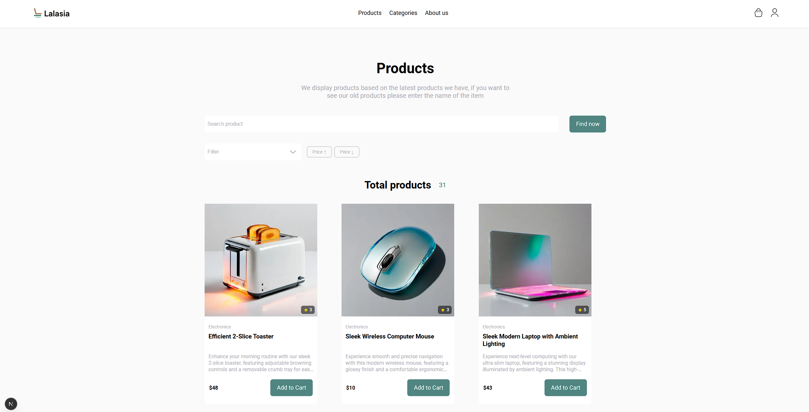
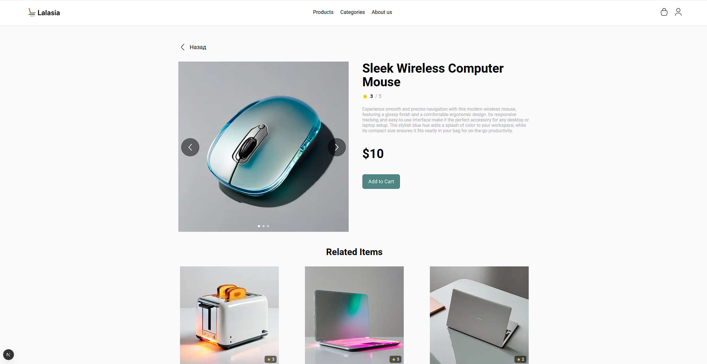
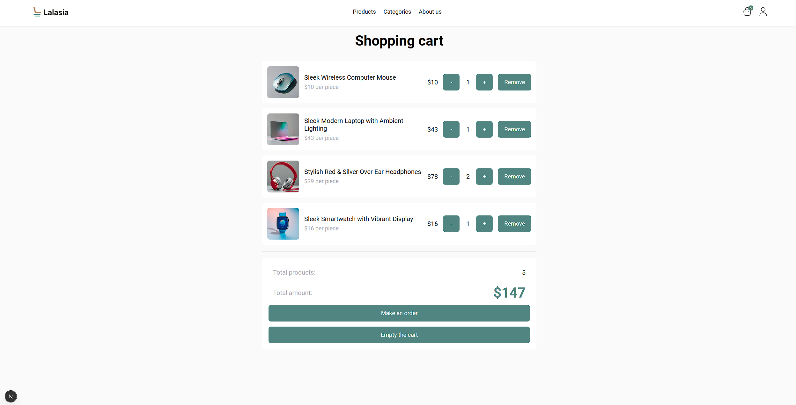
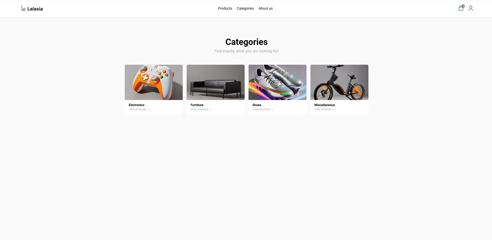
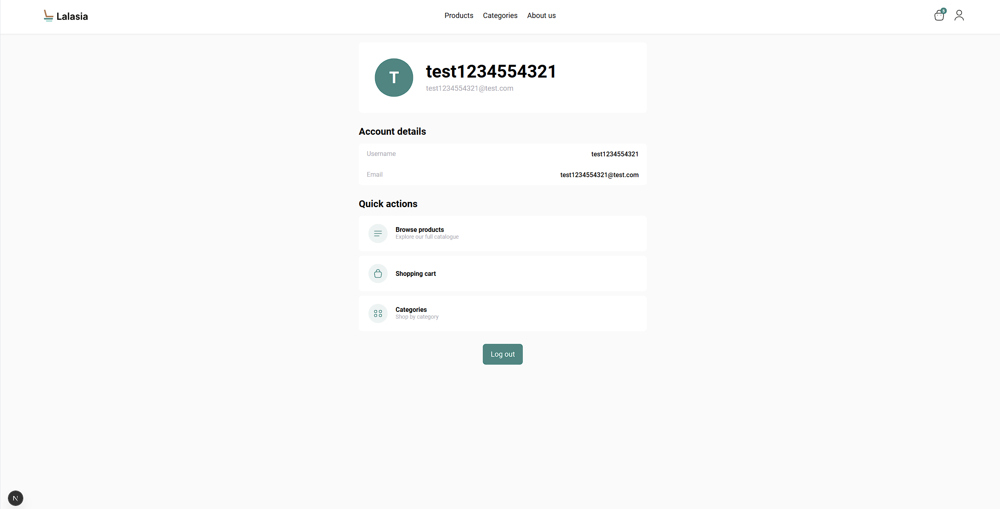

# KTS E-Commerce Store

Интернет-магазин различных вещей. Проект разработан в рамках обучения KTS.

## 🌐 Демо

**Продакшен:** https://kts-frontend-hw-3.vercel.app/

**Репозиторий:** https://github.com/vladbelyaevvv/kts-frontend-hw-3

## 📸 Скриншоты

### Главная страница


### Страница товара


### Корзина


### Категории


### Профиль пользователя


### Видео пример работы


## 🛠 Стек технологий

- **React 19** — UI библиотека
- **Next.js 16** — фреймворк для React
- **TypeScript** — типизация
- **MobX** — управление состоянием
- **Framer Motion** — анимации
- **Sass/SCSS** — стилизация
- **Axios** — HTTP-клиент

## 📦 Скрипты

```bash
# Запуск в режиме разработки
yarn dev

# Сборка для продакшена
yarn build

# Запуск продакшен-сборки
yarn start

# Линтинг кода
yarn lint

# Форматирование кода через Prettier
yarn format
```

## 🚀 Установка

1. Клонируйте репозиторий:
```bash
git clone https://github.com/vladbelyaevvv/kts-frontend-hw-3.git
cd kts-frontend-hw-3
```

2. Установите зависимости:
```bash
yarn install
```

3. Запустите проект:
```bash
yarn dev
```

Приложение будет доступно по адресу: http://localhost:3000

## 📁 Структура проекта

```
src/
├── api/                  # API клиенты
├── app/                    # Страницы приложения (Next.js App Router)
│   ├── about/             # Страница "О нас"
│   ├── cart/              # Корзина
│   ├── categories/        # Категории товаров
│   ├── product/[id]/      # Страница товара
│   ├── profile/           # Профиль пользователя
│   └── auth/              # Страницы авторизации
├── components/            # Переиспользуемые компоненты
│   ├── Button/           # Компонент кнопки
│   ├── Card/             # Карточка товара
│   ├── Input/            # Поле ввода
│   ├── Navbar/           # Навигационная панель
│   └── ...
├── providers             # провайдер
├── stores/               # MobX сторы
│   ├── productsStore.ts  # Стор товаров и категорий
│   ├── cartStore.ts      # Стор корзины
│   └── authStore.ts      # Стор авторизации
└── styles/               # Глобальные стили и переменные
```

## ✨ Функционал

- 📦 Просмотр каталога товаров с фильтрацией по категориям
- 🔍 Поиск товаров
- 🛒 Добавление товаров в корзину
- 📊 Управление количеством товаров в корзине
- 👤 Авторизация/регистрация
- 📝 Профиль пользователя
- 🎨 Адаптивный дизайн
- ✨ Плавные анимации с Framer Motion

## 🎨 Дизайн-система

Проект использует собственную дизайн-систему с SCSS-миксинами и переменными:
- Цветовая палитра
- Типографика
- Отступы
- Border radius
- Transition

## 📱 Адаптивность

Приложение полностью адаптировано для:
- 📱 Мобильных устройств (320px+)
- 📱 Планшетов (768px+)
- 💻 Десктопов (1024px+)

## 🔐 Авторизация

Для работы с корзиной и профилем необходимо авторизоваться. После входа в систему:
- Товары сохраняются в корзине
- Доступен профиль пользователя
- Доступно оформление заказа

---

**Дата:** Март 2025
